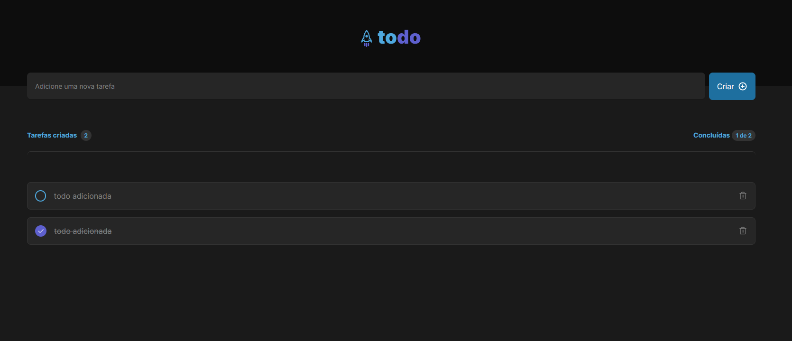

# Desafio 2 - Todo List

  

## Descrição

Nesse desafio, você vai desenvolver uma aplicação de controle de tarefas no estilo **to-do list**, que contém as seguintes funcionalidades:

    - Adicionar uma nova tarefa
    - Marcar e desmarcar uma tarefa como concluída
    - Remover uma tarefa da listagem
    - Mostrar o progresso de conclusão das tarefas

## Screenshot

## Tecnologias utilizadas:

-  Validação de formulário: Unform
-  Ícones: Phosphor React Icons

## Links

-  Site hospedado: [Todo List](https://todo-list-two-blond.vercel.app/)