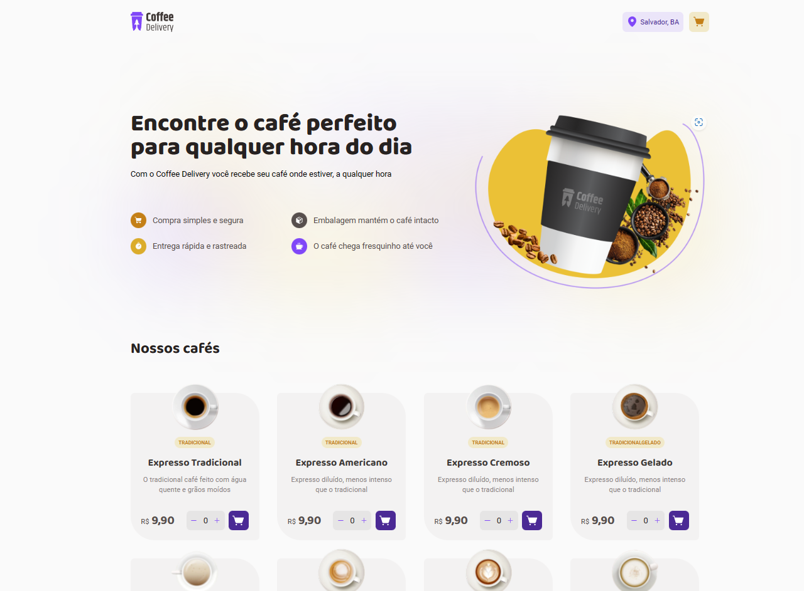

# Desafio 2 - Coffee Delivery

  

## Descrição

Nesse desafio, você vai desenvolver uma aplicação para gerenciar um carrinho de compras de uma cafeteria fictícia, que contém as seguintes funcionalidades:

    - Listagem de produtos (cafés) disponíveis para compra
    - Adicionar uma quantidade específicas de itens no carrinho
    - Aumentar ou remover a quantidade de itens no carrinho
    - Formulário para o usuário preencher o seu endereço
    - Exibir o total de itens no carrinho no Header
    - Exibir o valor total da soma de itens no carrinho multiplicados pelo valor

### Screenshot

### Tecnologias utilizadas:

-  Validação de formulário: Unform
-  Ícones: Phosphor React Icons

### Links

-  Site hospedado: [Coffee Delivery](https://coffee-delivery-jade.vercel.app/)